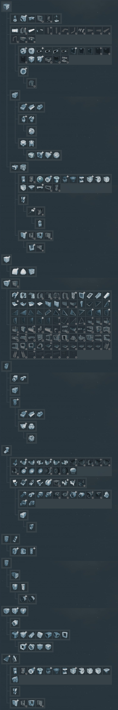
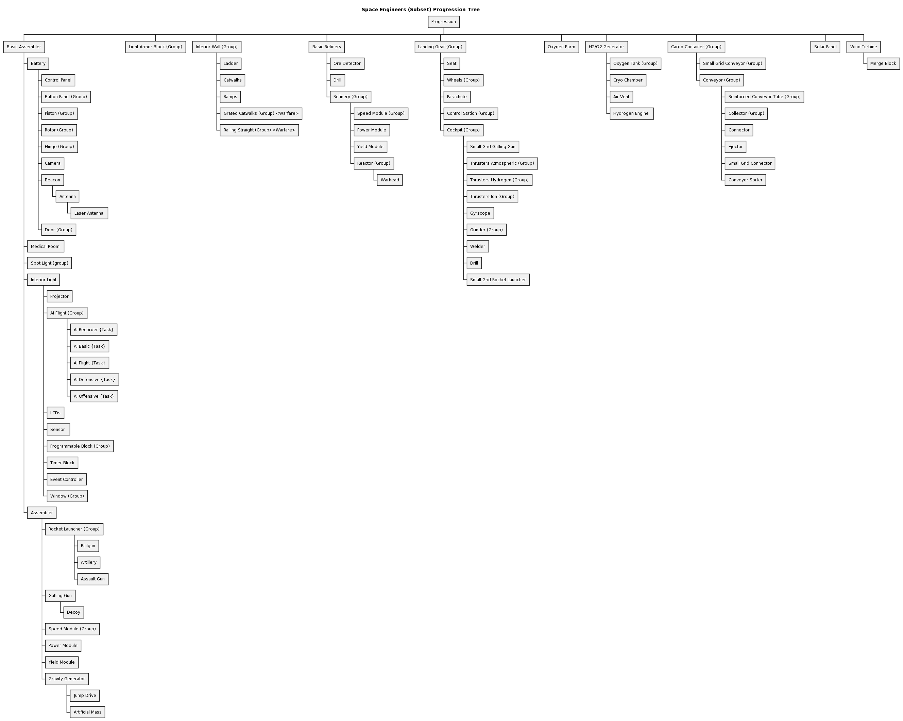
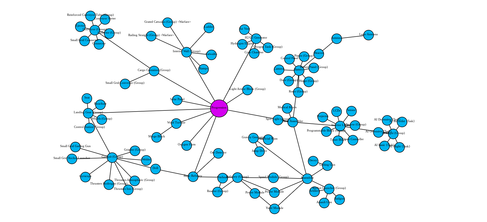

A Text-based Progression Tree
=============================

Trying to implement the (used) progression tree into [GraphML Editor](https://actuallyfro.github.io/Break-FAST/Examples/01_GraphML-Editor/Single-page-Apps/)... maybe.

A Soure
-------
From u/AhCrapItsYou [Progression Tree](https://www.reddit.com/r/spaceengineers/comments/n7ih2g/progression_tree_reference/)



The Code
--------
Uses [PlantUML](https://plantuml.com/) to render as a [Work Breakdown Structure (WBS) or 'Org Chart'](https://plantuml.com/wbs-diagram) diagram.
Alternatively, use PlantText.com to edit the [WBS](https://www.planttext.com/?text=fLN1Rjim3BtdAtHiaSE0dOUXQTAc7LeaY8C5Ep8susYH9OEIand3_dsKPJkMqvrsizwZPEhnaNgm3iXTzdOoST8f54a9AOeddKkDI5RS9TNUehiNQp8veRNIQB4bnCbaEiGcqwbu12jJCRCMYxr2OiXZpY7L_digvaOxCagiGQCAq6Fb79_O8E9kIQOgxmEpbjOp4ROnpb0ClKYTOmpDeK22zdo4jCdEBsRQeTQ1uUKRMAGE525-OU8VY7VCP0gAVssA9eObCawyoVpen5r-3NpbSqZoxePgxq3c9wQSSrZENiMp2Xi7-JRu1bD36QVpUmlszETA1577Q7lC65xW0RMLPxnXLeSF6F4sNzZmbJ3BkVTfvmH50Ln6yQXCUee5taeME101U3gZTbrvsz9FnKxgp5mYDIDp-7gc9sGneTBf4MaaomQaogk-UEIaFxlkrjP2fPnOjX5Y2Kwn6Ng0YycYjjPBIiHCl9kiKYEthCs5_noOWFoGgB88MHASfQl54ZKxgwldL7ohYb8iY6KT97cGgMJ3l8FrshPEcL5Xw4RBgsbse2B_ioPPrlRG7Dm5rAcf58jIbE6Bat9yfuxjTeilEw0347wTT29wLH97CBHU5DQwR8C7RlkWi5WHie2kjw-_frBXp3Ok5lB_9DvmeuwRcoq4T4J86Xr1Pqrv4U8EJH2QTXEx8wAo4RS6WlHOEPmCvq_YmCbujZ2NdahfHbSgV5cM9BCRTudjaIhh_8oSkSBOaltB4iPzqeUyr1dt5Ef_yQ_ZIRUioQQcxFt7hJJg3x5Z2Rj6wciJvJngBw_YwbVjqtW6AlpovVEdrUVOrbt85lGfLeXg8-P7AFQjBsUIn7Tk_6RHtp2y7NwIi3KfDutguFqIL-sQ9WUSiHxDtOz0xnAf3uPI7EpQLlln0-27q8sR_0uzcCPFmz4SfpCCw_-J6791nCGezc3tYZLpZhEWFL-oVJCeRmVdv05rnk_hNm00).

```PlantUML
@startwbs

title Space Engineers (Subset) Progression Tree

+ Progression
++ Basic Assembler
+++ Battery
++++ Control Panel
++++ Button Panel (Group)
++++ Piston (Group)
++++ Rotor (Group)
++++ Hinge (Group)
++++ Camera
++++ Beacon
+++++ Antenna
++++++ Laser Antenna 
++++ Door (Group)
+++ Medical Room
+++ Spot Light (group)
+++ Interior Light
++++ Projector
++++ AI Flight (Group)
+++++ AI Recorder {Task}
+++++ AI Basic {Task}
+++++ AI Flight {Task}
+++++ AI Defensive {Task}
+++++ AI Offensive {Task}
++++ LCDs
++++ Sensor 
++++ Programmable Block (Group)
++++ Timer Block
++++ Event Controller
++++ Window (Group)
++++ Sound Block
+++++ Jukebox
+++ Assembler
++++ Rocket Launcher (Group)
+++++ Railgun
+++++ Artillery
+++++ Assault Gun
++++ Gatling Gun
+++++ Decoy
++++ Speed Module (Group)
++++ Power Module
++++ Yield Module
++++ Gravity Generator
+++++ Jump Drive
+++++ Artificial Mass
++ Light Armor Block (Group)
++ Interior Wall (Group)
+++ Ladder
+++ Catwalks
+++ Ramps
+++ Grated Catwalks (Group) <Warfare>
+++ Railing Straight (Group) <Warfare>
++ Basic Refinery
+++ Ore Detector
+++ Drill
+++ Refinery (Group)
++++ Speed Module (Group)
++++ Power Module
++++ Yield Module
++++ Reactor (Group)
+++++ Warhead
++ Landing Gear (Group)
+++ Seat
+++ Wheels (Group)
+++ Parachute
+++ Control Station (Group)
+++ Cockpit (Group)
++++ Flight Seat
+++++ Small Grid Gatling Gun
+++++ Thrusters Atmospheric (Group)
+++++ Thrusters Hydrogen (Group)
+++++ Thrusters Ion (Group)
+++++ Gyrscope
+++++ Grinder (Group)
+++++ Welder
+++++ Drill
++++ Rocket Launcher(Group)
+++++ Reloadable Rocket Launcher
++++ Railgun
++ Oxygen Farm
++ H2/O2 Generator
+++ Oxygen Tank (Group)
++++ H2 Tank
+++++ Hydrogen Thrusters
+++ Cryo Chamber
+++ Air Vent
+++ Hydrogen Engine 
++ Cargo Container (Group)
+++ Small Grid Conveyor (Group)
+++ Conveyor (Group)
++++ Reinforced Conveyor Tube (Group)
++++ Collector (Group)
++++ Connector
++++ Ejector
++++ Small Grid Connector
++++ Conveyor Sorter
++ Solar Panel
++ Wind Turbine
+++ Merge Block
@endwbs
```

Rendering
---------



